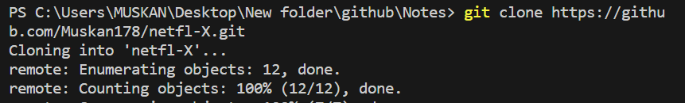

# netfl-X
Demo of netflix page
 
Commit means save the changes in github

Clone = To copy the repository(folders we created in github or we can say remotely) is called cloning
   : git clone <-link of remotely created folder->
    

ls = command to see the files in github
ls -a = command to see all the files in github

To configuring git : 

        git config --global user.name "my name"
        git config --global user.email "my email address"
        git config --list

untracked  :  new files that git doesn't yet track
modified   :  changed
staged     :  file is ready to be committed
                (add the but yet to commit)            
unmodified :  unchanged

add : adds new or changed files in your working mdirectory to the git staging area  
        git add <- file name ->
        git add .   (. to add all the changes)

commit - it is record of change
        git commit -m "some message"

push  - upload local repo content to remote repo
        git push origin main